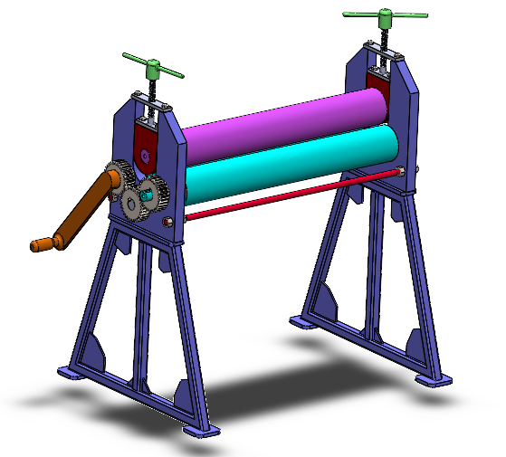
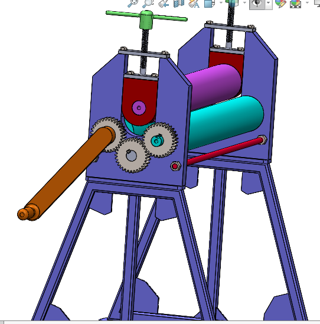
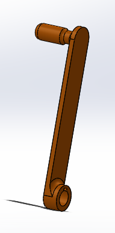

# Sheet Rolling Machine (Automatuc & Manual)

## Assembly

## Parts 

### 1. Main Support

### 2. Adjusting pad

### 3. Bearing Block lifter

### 4. Main Roller

### 5. Shaft Roller

### 6. Threded Stud

### 7. Handle

### 8. Handle for lifting plate

### 9. Spur Gear

